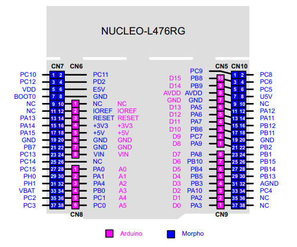

# Code from the Estructuras course

Contains the final project (Joystick controlled Robot Arm) and multiple basic examples for other peripherals for the STM32L476RG, only Core files and .ioc included.

Everything uses the HAl drivers.

